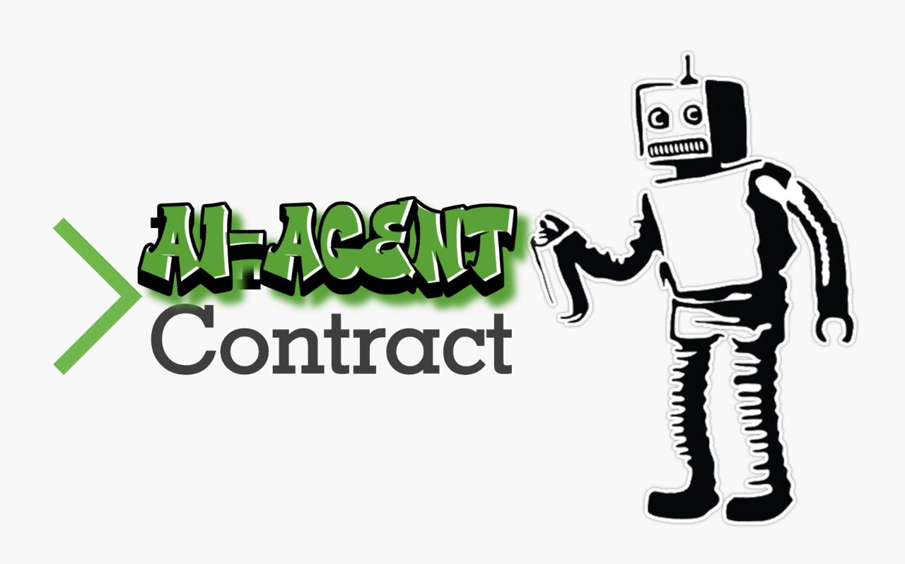
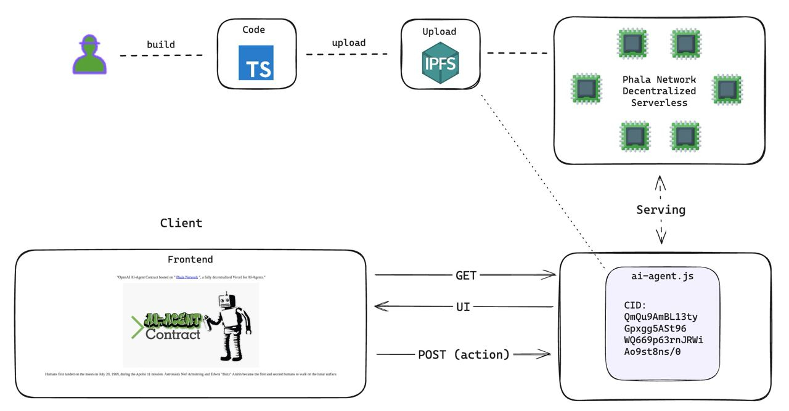

<div align="center">
  <a href="https://github.com/Phala-Network/ai-agent-template-langchain">
    <h1>AI-Agent Contract Template with OpenAI</h1>
    
    <br />
  </a>
  <a href="https://platform.openai.com/docs/api-reference">
    
    <br />
  </a>
  <p align="center">
    Host your AI-Agent Contract on Phala's decentralized serverless cloud.
    <br />
    <a href="https://github.com/Phala-Network/ai-agent-template-langchain"><strong>Explore the docs »</strong></a>
    <br />
    <br />
    <a href="QmQu9AmBL13tyGpxgg5ASt96WQ669p63rnJRWiAo9st8ns/0?key=c0c0105ba56276cd&chatQuery=When%20did%20humans%20land%20on%20the%20moon">View Demo</a>
    ·
    <a href="https://github.com/Phala-Network/ai-agent-template-langchain/issues">Report Bug</a>
    ·
    <a href="https://discord.gg/DXGGJajW">Discord</a>
  </p>

  <h3>Architecure Overview</h3>
  
</div>

## 🤖 What Is This?!

---
<div align="center">
  
</div>

The OpenAI AI-Agent template is a **MINIMAL** template to build an AI-Agent that can be hosted on Phala Network's decentralized hosting protocol. Unlike Vercel or other FaaS, it allows you to publish your AI-Agent compiled code to IPFS and hosts it on a fully decentralized FaaS cloud with the following benefits:

- 💨 Ship Fast: Build and ship with familiar toolchain in minutes
- ⛑️ Secure: Execution guarded by rock solid TEE / Intel SGX
- 🔒 Private: Host API keys and user privacy at ease
- 💎 Unstoppable: Powered by IPFS and Phala's 35k+ decentralized TEE workers

[//]: # ()

## Getting Started
### Prepare
Install dependencies
```shell
npm install
```

### Testing Locally
Create `.env` file and add your OpenAI API Key
```shell
cp .env.local .env
```

In `.env` file replace `YOUR_OPENAI_KEY` with your API Key
```text
OPENAI_API_KEY="YOUR_OPENAI_KEY"
```

Build your Agent
```shell
npm run build
```

Test your Agent locally
```shell
npm run test
```

Expected Test Results
```shell
INPUT: {"method":"GET","path":"/ipfs/QmVHbLYhhYA5z6yKpQr4JWr3D54EhbSsh7e7BFAAyrkkMf","queries":{"chatQuery":["Who are you?"]},"secret":{"openaiApiKey":"YOUR_OPENAI_KEY"},"headers":{}}
GET RESULT: {
  status: 200,
  body: '\n' +
    '    <!DOCTYPE html>\n' +
    '    <html lang="en">\n' +
    '        <head>\n' +
    '            <meta charset="utf-8" />\n' +
    '            <title>TestUI</title>\n' +
    '        </head>\n' +
    '        <body>\n' +
    '            <div align="center">\n' +
    '                <p>I am an AI-powered digital assistant here to help answer your questions and assist you with various tasks. How can I assist you today?</p>\n' +
    '            </div>\n' +
    '        </body>\n' +
    '    </html>',
  headers: {
    'Content-Type': 'text/html; charset=UTF-8',
    'Access-Control-Allow-Origin': '*'
  }
}


INPUT: {"method":"POST","path":"/ipfs/QmVHbLYhhYA5z6yKpQr4JWr3D54EhbSsh7e7BFAAyrkkMf","queries":{"chatQuery":["When did humans land on the moon?"]},"secret":{"openaiApiKey":"YOUR_OPENAI_KEY"},"headers":{},"body":"{\"untrustedData\":{\"fid\":2,\"url\":\"https://fcpolls.com/polls/1\",\"messageHash\":\"0xd2b1ddc6c88e865a33cb1a565e0058d757042974\",\"timestamp\":1706243218,\"network\":1,\"buttonIndex\":2,\"castId\":{\"fid\":226,\"hash\":\"0xa48dd46161d8e57725f5e26e34ec19c13ff7f3b9\"}},\"trustedData\":{\"messageBytes\":\"d2b1ddc6c88e865a33cb1a565e0058d757042974...\"}}"}
POST RESULT: {
  status: 200,
  body: '\n' +
    '    <!DOCTYPE html>\n' +
    '    <html lang="en">\n' +
    '        <head>\n' +
    '            <meta charset="utf-8" />\n' +
    '            <title>TestUI</title>\n' +
    '        </head>\n' +
    '        <body>\n' +
    '            <div align="center">\n' +
    "                <p>Humans first landed on the moon on July 20, 1969, during NASA's Apollo 11 mission.</p>\n" +
    '            </div>\n' +
    '        </body>\n' +
    '    </html>',
  headers: {
    'Content-Type': 'text/html; charset=UTF-8',
    'Access-Control-Allow-Origin': '*'
  }
}
```

### Publish Your AI-Agent
Upload your compiled AI-Agent code to IPFS.
```shell
npm run publish
```

Upon a successful upload, the command should show the URL to access your AI-Agent.
> AI-Agent deployed at: https://frames.phatfn.xyz/ipfs/QmQu9AmBL13tyGpxgg5ASt96WQ669p63rnJRWiAo9st8ns/0
>
> Make sure to add your secrets to ensure your AI-Agent works properly.

<details>
<summary>New to thirdweb?</summary>
We use <a href="https://thirdweb.com/dashboard/infrastructure/storage">thirdweb Storage</a> to host IPFS contents. If you are new to thirdweb, the command will guide you to create your account or login to your existing account from the browser. (You may need to forward port 8976 if you are accessing a remote console via SSH.)
</details>

### Access the Published AI-Agent

Once published, your AI-Agent is available at the URL: `https://frames.phatfn.xyz/ipfs/<your-cid>`. You can get it from the "Publish to IPFS" step.

You can test it with `curl`.

```bash
curl https://frames.phatfn.xyz/ipfs/<your-cid>
```

### Add Secrets

By default, all the compiled JS code is visible for anyone to view if they look at IPFS CID. This makes private info like API keys, signer keys, etc. vulnerable to be stolen. To protect devs from leaking keys, we have added a field called `secret` in the `Request` object. It allows you to store secrets in a vault for your AI-Agent to access.

<details>
<summary><b>How to Add Secrets</b></summary>

The steps to add a `secret` is simple. We will add the [OpenAI](https://platform.openai.com/docs/quickstart?context=node) API Key in this example by creating a secret JSON object with the `openaiApiKey`:

```json
{"openApiKey": "<OPENAI_API_KEY>"}
```

Then in your frame code, you will be able to access the secret key via `req.secret` object:

```js
async function POST(req: Request): Promise<Response> {
    const apiKey = req.secret?.apiKey
}
```

> **Note**: Before continuing, make sure to publish your compiled AI-Agent JS code, so you can add secrets to the CID.

**Open terminal**
Use `curl` to `POST` your secrets to `https://frames.phatfn.xyz/vaults`. Replace `IPFS_CID` with the CID to the compile JS code in IPFS, and replace `<OPENAI_API_KEY>` with your OpenAI API key.

The command will look like this:
```shell
curl https://frames.phatfn.xyz/vaults -H 'Content-Type: application/json' -d '{"cid": "IPFS_CID", "data": {"apiKey": "<OPENAI_API_KEY>"}}'
# Output:
# {"token":"e85ae53d2ba4ca8d","key":"e781ef31210e0362","succeed":true}
```

The API returns a `token` and a `key`. The `key` is the id of your secret. It can be used to specify which secret you are going to pass to your frame. The `token` can be used by the developer to access the raw secret. You should never leak the `token`.

To verify the secret, run the following command where `key` and `token` are replaced with the values from adding your `secret` to the vault.
```shell
curl https://frames.phatfn.xyz/vaults/<key>/<token>
```

Expected output:
```shell
{"data":{"apiKey":"<OPENAI_API_KEY>"},"succeed":true}
```

If you are using secrets, make sure that your URL is set in the following syntax where `cid` is the IPFS CID of your compiled JS file and `key` is the `key` from adding secrets to your vault.
```text
https://frames.phatfn.xyz/ipfs/<cid>?key=<key>
```

Example:
https://frames.phatfn.xyz/ipfs/QmQu9AmBL13tyGpxgg5ASt96WQ669p63rnJRWiAo9st8ns/0?key=c0c0105ba56276cd&chatQuery=When%20did%20humans%20land%20on%20the%20moon

</details>

## FAQ

<details>
<summary><b>What packages can I use in the ai-agent server?</b></summary>
<ul>
  <li>Most of the npm packages are supported: viem, onchainkit, ….</li>
  <li>Some packages with some advanced features are not supported:</li>
  <ul>
    <li>Large code size. Compiled bundle should be less than 500kb.</li>
    <li>Large memory usage, like image generation</li>
    <li>Web Assembly</li>
    <li>Browser only features: local storage, service workers, etc</li>
  </ul>
</ul>
</details>

<details>
<summary><b>What’s the spec of the Javascript runtime?</b></summary>
<ul>
  <li>The code runs inside a tailored <a href="https://bellard.org/quickjs/">QuickJS engine</a></li>
  <li>Available features: ES2023, async, fetch, setTimeout, setInterval, bigint</li>
  <li>Resource limits</li>
  <ul>
    <li>Max execution time 10s</li>
    <li>Max memory usage: 16 mb</li>
    <li>Max code size: 500 kb</li>
    <li>Limited CPU burst: CPU time between async calls is limited. e.g. Too complex for-loop may hit the burst limit.</li>
  </ul>
</ul>
</details>

<details>
<summary><b>Why is the serverless platform secure?</b></summary>
<ul>
  <li>Your AI-Agent code on is fully secure, private, and permissionless. Nobody can manipulate your program, steal any data from it, or censor it.</li>
  <li>Security: The code is executed in the decentralized TEE network running on Phala Network. It runs code inside a secure blackbox (called enclave) created by the CPU. It generates cryptographic proofs verifiable on Phala blockchain. It proves that the hosted code is exactly the one you deployed.</li>
  <li>Privacy: You can safely put secrets like API keys or user privacy on Phala Network. The code runs inside TEE hardware blackboxs. The memory of the program is fully encrypted by the TEE. It blocks any unauthorized access to your data.</li>
  <li>Learn more at <a href="https://phala.network">Phala Network Homepage</a></li>
</details>

<details>
<summary><b>What's TEE / Intel SGX?</b></summary>
<ul>
  <li><a href="https://collective.flashbots.net/t/tee-sgx-wiki/2019">TEE/SGX wiki</a></li>
  <li><a href="https://collective.flashbots.net/t/debunking-tee-fud-a-brief-defense-of-the-use-of-tees-in-crypto/2931">Debunking TEE FUD: A Brief Defense of The Use of TEEs in Crypto</a></li>
</details>
